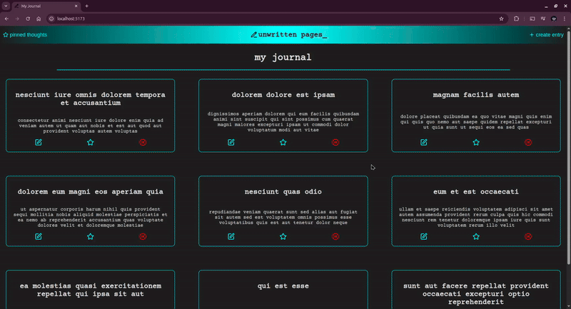
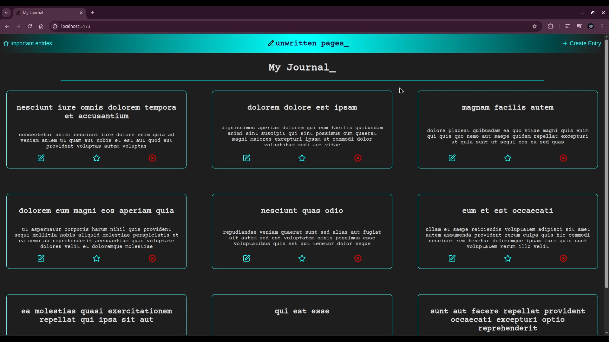
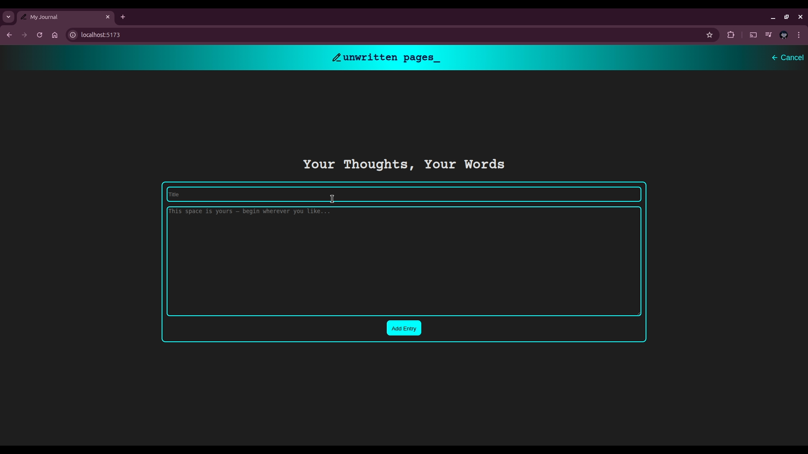
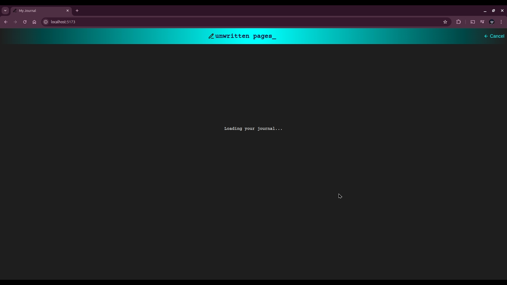
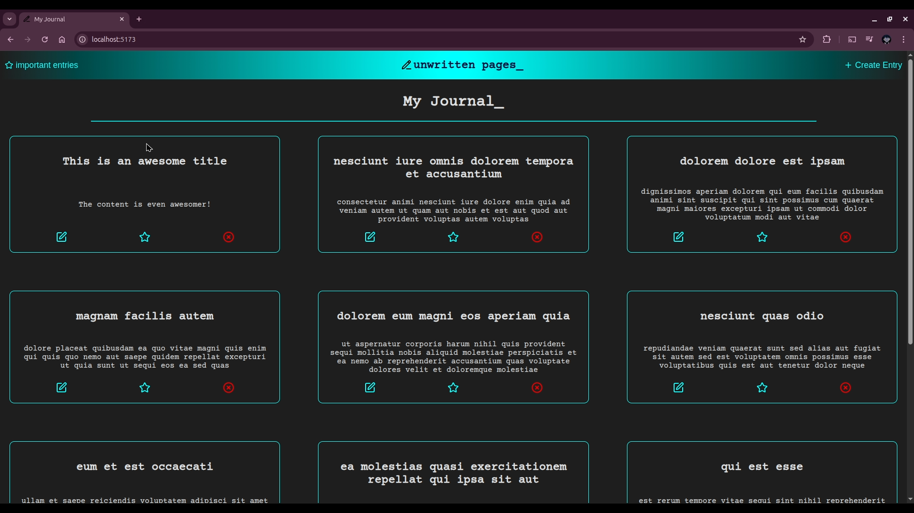
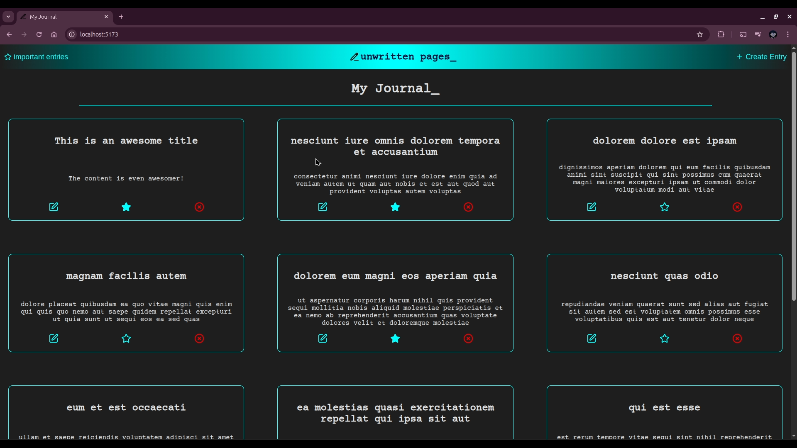
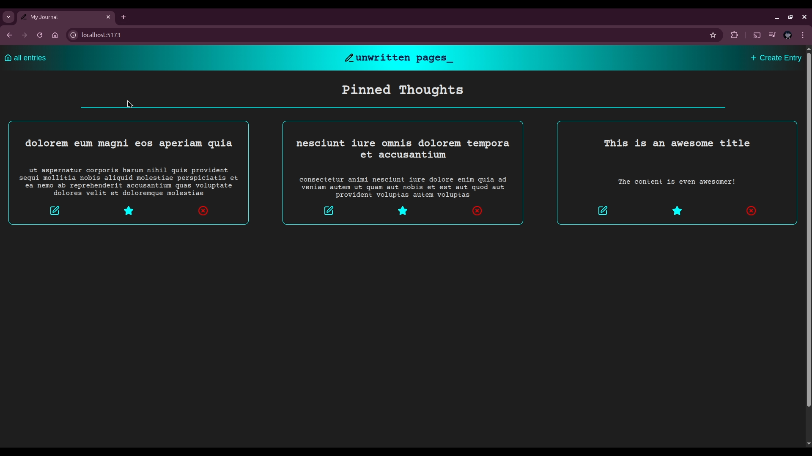
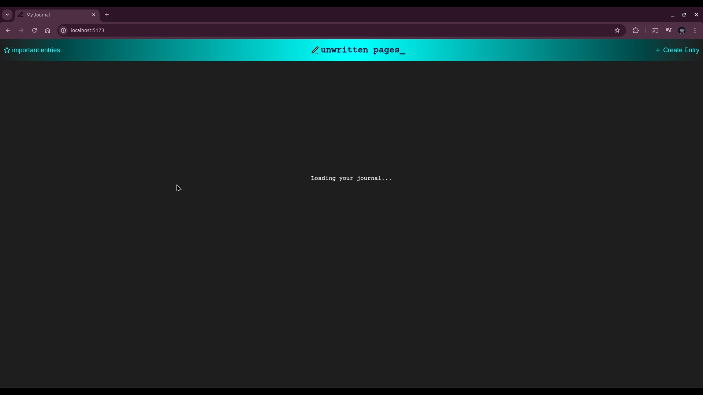

# **unwritten pages_**

unwritten pages_ is a minimalist journaling web app built with React, focused on clarity, simplicity, and deliberate UI/UX decisions. The project emphasizes clean component architecture, predictable state management, and thoughtful user experience design.

> This project was built as a solo full-stack frontend exercise to strengthen my skills in modern React development, UI state handling, and clean code structure.



## **Features**

- `Create Journal Entries` – Write and save personal notes and reflections.

- `Edit & Delete Entries` – Full CRUD functionality.

- `Mark as Important` – Star meaningful entries for quick access.

- `Filtered Views` – Toggle between all entries and important ones.

- `Optimistic UI Updates` – Immediate UI feedback while syncing data.

- `Mock API Integration` – JSONPlaceholder used to simulate real backend workflows.

## **Technical Highlights**

- Modular component architecture for clarity and maintainability

- Centralized state handling for predictable UI updates

- Clean separation of UI, logic, and API layers

- Responsive layout using CSS Modules

- Emphasis on readability, accessibility, and minimal visual noise

## **Tech Stack**

- `Frontend:` React, Vite
- `Styling:` CSS Modules
- `API:` JSONPlaceholder (mock REST API)

## **Project Goals**

- Build a production-style React application from scratch

- Practice real-world CRUD patterns

- Improve UI clarity and design restraint

- Implement predictable state and UI synchronization-

## **Setup & Installation**

### Prerequisites

- [Node.js](https://nodejs.org) (v14+)

- [npm](https://www.npmjs.com)

### Installation

1. Clone the repository:

   ```bash
   git clone https://github.com/Moringa-SDF-PT10/journal-reagan-nyauma.git
   ```

2. Navigate to the project folder:

   ```bash
   cd journal-reagan-nyauma
   ```

3. Install dependencies:
   ```bash
   npm install
   ```

### Running the app

Start the development server:

```bash
npm run dev
```

Then open http://localhost:5173

## **Screenshots**

- Default state of the app, with placeholder entries fetched from [JSONPlaceholder](https://jsonplaceholder.typicode.com/posts?_limit=9):

  

- Form for creating journal entries:

  

- Loading the list of journal entries after creating/editing an entry:

  

- Updated journal after creating a new entry:

  

- Form for editing an existing journal entry:

  

- UI change after some entries are marked as important:

  

- Filtered journal showing just the important entries:

  

- Loading screen for when app loads, page is refreshed, or an entry is deleted:

  


## **Possible Future Improvements**

- Real backend integration (Flask)

- Authentication and user accounts

- Markdown editor support

- Cloud-based persistent storage

- Mobile-first layout improvements